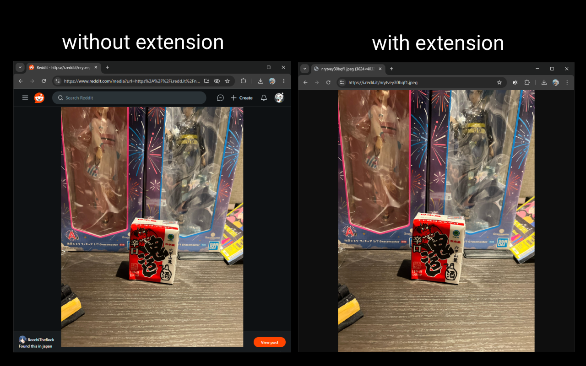

# stop i.redd.it redirects
have you ever opened an i.redd.it link in a new tab, only to get redirected to a page that loads ~2mb of unnecessary assets and doesn't even let you zoom in with ctrl+scroll wheel? well, this extension sets out to solve that.

## installation
the extension is also published to the [chrome webstore](https://chromewebstore.google.com/detail/stop-ireddit-redirects/fhongcbgjhfinandonifkacibmabcdie) and [firefox's add-ons store](https://addons.mozilla.org/firefox/addon/stop-i-redd-it-redirects/), but you can also manually install the extension by following these instructions:

### chrome
1. download this repository (either by git cloning or downloading a zip & unzipping it)
2. go to the extensions page
3. enable "developer mode"
4. click "load unpacked"
5. select the (extracted) folder the repository is located in
6. done!

### firefox
firefox is always a PITA when it comes to unsigned extensions, as you'll need to re-add the extension everytime you restart your browser, unless you're using [firefox developer edition](https://www.firefox.com/en-US/channel/desktop/developer/)

#### normal firefox
1. download this repository (either by git cloning or downloading a zip & unzipping it)
2. go to `about:debugging#/runtime/this-firefox`
3. click "load temporary add-on"
4. go to the folder the repository is located in
5. select the manifest.json

#### firefox developer edition
1. zip the repository up
2. go to `about:config`
3. set `xpinstall.signatures.required` to `false`
4. go to the add-ons page (`about:addons`)
5. click the little cog in the top-right corner and select `Install Add-on From File...`
6. select the zip file